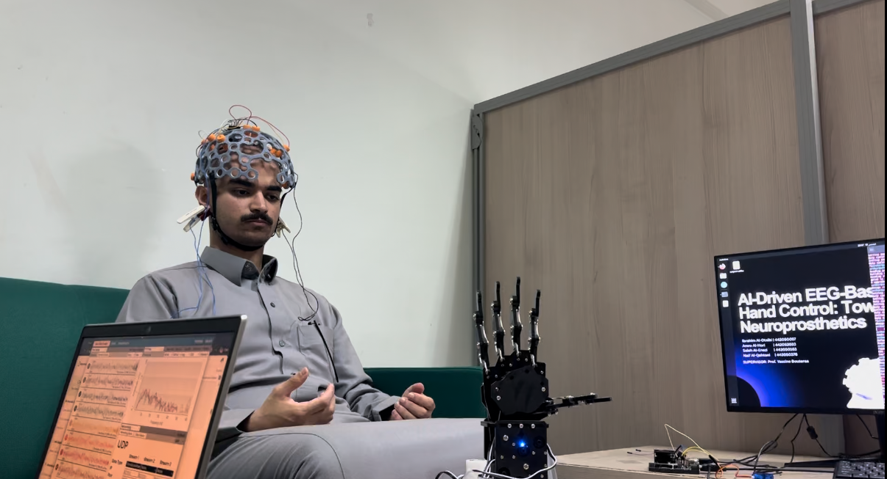

# EEG Sessions Dataset (Naif’s Brain Data)

Welcome to Naif’s brain data.

Yes, this is real EEG data.

Handle with care.

---

## Files

Format:
session_XX.csv

From:
session_00.csv → session_039.csv  
Total: 40 sessions

Each file = one brain session.

---

## File Structure

Each CSV file is organized as:

timestamp,label,FC3,C3,CP3,Cz,FCz,FC4,C4,CP4

Where:
- timestamp: time of the signal
- label: session/class label
- FC3–CP4: EEG channels

---

## Sample

Example from one session:



One small look into Naif’s brain.

---

## Usage

Quick load example:

```python
import pandas as pd

data = pd.read_csv("session_00.csv")
```
## Notes

- All sessions use the same setup.

- Files are ordered.

- Data is raw and unfiltered.